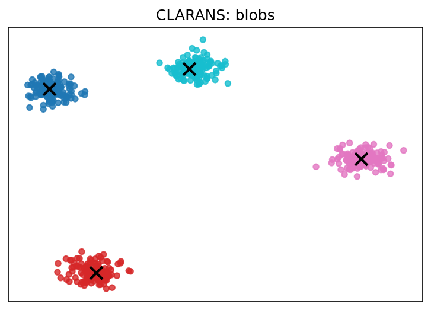

# scikit-clarans

> **Robust, scalable k-medoids clustering compatible with scikit-learn.**

[](LICENSE)
[](https://www.python.org/downloads/)
[](https://github.com/ThienNguyen3001/scikit-clarans/actions/workflows/python-package.yml)
[](https://colab.research.google.com/drive/1JdgVaZcbS1uwY7kPQZM8DtX97R9ga31d?usp=sharing)

**scikit-clarans** acts as a bridge between the high quality of standard k-medoids (PAM) and the speed required for large datasets. By using randomized search, it finds high-quality medoids efficiently without exploring the entire graph of solutions.

---

<p align="center">
  
</p>

## Key Features

*   **Scikit-Learn Native**: Drop-in compatible with `fit`, `predict`, and `Pipeline` workflows.
*   **Scalable**: Optimized for datasets where exhaustive PAM is too slow. Includes a **FastCLARANS** variant with distance caching.
*   **Flexible Metrics**: Supports any distance metric (European, Manhattan, Cosine, Haversine, Precomputed, etc.).
*   **Smart Initialization**: Comes with `k-medoids++` for faster convergence and better starting points.
*   **Robust**: Medoid-based centers are less sensitive to outliers than K-Means centroids.

## Installation

Install the latest version from PyPI (coming soon) or directly from source:

```bash
# From source
pip install .

# For development
pip install -e .[dev]
```

## Quick Start

Get clustering in 3 lines of code:

```python
from clarans import CLARANS
from sklearn.datasets import make_blobs

# 1. Generate data
X, _ = make_blobs(n_samples=1000, centers=5, random_state=42)

# 2. Fit model
model = CLARANS(n_clusters=5, numlocal=3, init='k-medoids++', random_state=42)
model.fit(X)

# 3. Predict & Inspect
labels = model.labels_
medoids = model.cluster_centers_

print(f"Found {len(medoids)} medoids.")
```

## FastCLARANS

For datasets that fit in memory, **FastCLARANS** can provide significant speedups by caching pairwise distances:

```python
from clarans import FastCLARANS

fast_model = FastCLARANS(n_clusters=5, numlocal=3, random_state=42)
fast_model.fit(X)
```

<!-- ## Comparison

| Feature | KMeans | PAM (k-medoids) | CLARANS |
| :--- | :--- | :--- | :--- |
| **Center** | Mean (Centroid) | Actual Point (Medoid) | Actual Point (Medoid) |
| **Complexity** | Low $O(k \cdot n)$ | High $O(k(n-k)^2)$ | Moderate (Adjustable) |
| **Outliers** | Sensitive | **Robust** | **Robust** |
| **Large Data** | Excellent | Poor | **Good** | -->

## Documentation & Examples

*   **[Full Documentation](./docs)**: API reference, gallery, and detailed user guide.
*   **[Examples Folder](./examples)**: Runnable Python scripts showing:
    *   Basic usage & API demos.
    *   Comparison with other algorithms.
    *   Handling sparse matrices and custom metrics.
*   **[Interactive Notebook](./examples/clarans_examples.ipynb)**: Try it out immediately in Jupyter.

## Contributing

We welcome contributions! Please see [CONTRIBUTING.md](CONTRIBUTING.md) for details on how to submit pull requests, report issues, or request features.

## License

This project is licensed under the **MIT License**. See the [LICENSE](LICENSE) file for details.
